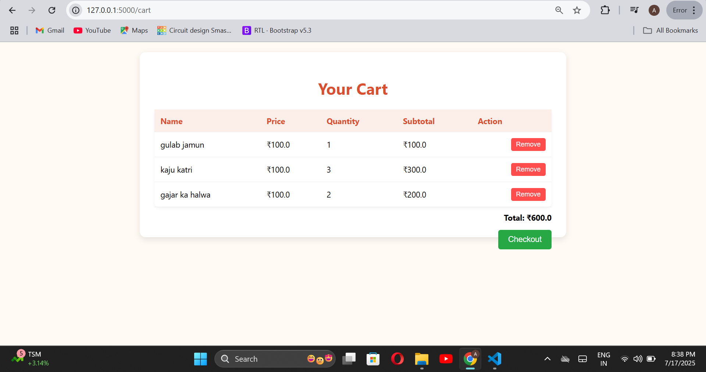

# 🍬 Sweet Shop Management System

A full-featured inventory management web application for sweet shops, built with **Flask**, **HTML/CSS**, **SQLite**, and **Git**. It allows sweet shop owners to manage sweets, including adding, deleting, restocking, searching, sorting, and viewing inventory with pagination.

---

## Features

- Add, delete, and restock sweets
- Search sweets by name
- Sort sweets by name, price, or quantity (asc/desc)
- Pagination (5 sweets per page)
- Fully responsive frontend with HTML/CSS
- SQLite database integration using SQLAlchemy
- Git version control

---

## Tech Stack

- **Frontend:** HTML5, CSS3
- **Backend:** Python, Flask
- **Database:** SQLite (via SQLAlchemy)
- **Testing:** Pytest
- **Version Control:** Git

---

## Testing

- Unit tests written with `pytest` for:
  - Adding sweets
  - Deleting sweets
  - Restocking
  - Searching by name, category, price
  - Purchasing logic with validations

---

##  Customer Cart & Purchase
Customers can:
  - View available sweets with quantity and price.
  - Add items to a shopping cart.
  - Adjust quantity before purchase.
  - Remove items from the cart.
  - Checkout only if sufficient stock is available.
  - After successful checkout, stock is updated in the owner’s inventory.
🖼️ Screenshot: Customer Cart

##  Screenshots

###  Owner Dashboard

### Customer Cart

